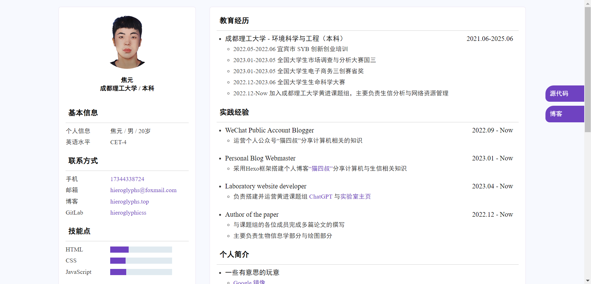

# 极简个人简历

此项目基于**拾迹**的开源项目 [非你莫属-个人简历模板](https://gitee.com/itsay/resume) 进行二次开发，更加简约美观。


预览：[焦元的简历](https://resume.hieroglyphs.top)

# 简历截图



# 特性

基于原项目做了以下修改

- 修复了过时的代码
- 更换纯色背景
- 去除元素的阴影效果
- 添加元素边框与`hover`边框变色属性
- 修复头像无法加载的问题
- 修改字体为 Time New Roman 和黑体
- 统一页面布局

# 快速开始

使用 Git 克隆本仓库或直接 [下载](https://github.com/hieroglyphicss/resume-template/archive/refs/tags/resume.zip) 资源包

依据修改`index.html`中的信息即可

## 站点设置

```html
<!-- 页面标题 -->
<title>焦元的简历</title>
<!-- 站点图标 -->
<link rel="shortcut icon" href="https://npm.elemecdn.com/hieroglyphs.package/resume/img/favicon.ico" type="image/x-icon">
```

## 个人头像

```html
<!-- 头像照片 -->

```

## 个人信息

```html
<!-- 个人信息 -->
<h1 class="name">焦元</h1>
<h4 class="info-job">成都理工大学 / 本科</h4>
```

## 基本信息

```html
<!-- 基本信息 -->
            <section class="profile info-unit">
                <h2>
                    <i class="fa fa-user" aria-hidden="true"></i>基本信息</h2>
                <hr/>
                <ul>
                    <li>
                        <label>个人信息</label>
                        <span>焦元 / 男 / 20 岁</span>
                    </li>
                    <li>
                        <label>英语水平</label>
                        <span>CET-4</span>
                    </li>
                </ul>
            </section>
```

## 联系方式

```html
            <!-- 联系方式 -->
            <section class="contact info-unit">
                <h2>
                    <i class="fa fa-phone" aria-hidden="true"></i>联系方式</h2>
                <hr/>
                <ul>
                    <li>
                        <label>手机</label>
                        <a href="tel:17344338724" target="_blank">17344338724</a>
                    </li>
                    <li>
                        <label>邮箱</label>
                        <a href="mailto:hieroglyphs@foxmail.com" target="_blank">hieroglyphs@foxmail.com</a>
                    </li>
                    <li>
                        <label>主页</label>
                        <a href="https://www.hieroglyphs.top/" target="_blank">hieroglyphs</a>
                    </li>
                    <li>
                        <label>博客</label>
                        <a href="https://blog.hieroglyphs.top/" target="_blank">猫四叔</a>
                    </li>
                    <li>
                        <label>GitLab</label>
                        <a href="https://gitlab.com/hieroglyphs" target="_blank">hieroglyphs</a>
                    </li>
                </ul>
            </section>
```

## 技能点

```html
            <!-- 技能点 -->
            <section class="skill info-unit">
                <h2>
                    <i class="fa fa-code" aria-hidden="true"></i>技能点</h2>
                <hr/>
                <ul>
                    <li>
                        <label>HTML</label>
                        <progress value="30" max="100"></progress>
                    </li>
                    <li>
                        <label>CSS</label>
                        <progress value="25" max="100"></progress>
                    </li>
                    <li>
                        <label>JavaScript</label>
                        <progress value="26" max="100"></progress>
                    </li>
                </ul>
            </section>
```

## 教育经历

```html
            <!-- 教育经历 -->
            <section class="edu info-unit">
                <h2>
                    <i class="fa fa-graduation-cap" aria-hidden="true"></i>教育经历</h2>
                <hr/>
                <ul>
                    <li>
                        <h3>
                            <span>成都理工大学 - 环境科学与工程（本科）</span>
                            <time>2021.06-2025.06</time>
                        </h3>
                        <ul class="info-content">
                            <li>2022.05-2022.06 宜宾市 SYB 创新创业培训</li>
                            <li>2023.01-2023.05 全国大学生市场调查与分析大赛国三</li>
                            <li>2023.01-2023.05 全国大学生电子商务三创赛省奖</li>
                            <li>2022.12-2023.06 全国大学生生命科学大赛</li>
                            <li>2022.12-Now 加入成都理工大学黄进课题组，主要负责生信分析与网络资源管理</li>
                            </ul>
                    </li>
                </ul>
            </section>
```

## 实践经验

```html
            <!-- 工作经历 -->
            <section class="work info-unit">
                <h2>
                    <i class="fa fa-shopping-bag" aria-hidden="true"></i>实践经验</h2>
                <hr/>
                <ul>
                    <li>
                        <h3>
                            <span>WeChat Public Account Blogger</span>
                            <time>2022.09 - Now</time>
                        </h3>
                        <ul class="info-content">
                            <li>运营个人公众号“猫四叔”分享计算机相关的知识</li>
                        </ul>
                    </li>
                    <li>
                        <h3>
                            <span>Personal Blog Webmaster</span>
                            <time>2023.01 - Now</time>
                        </h3>
                        <ul class="info-content">
                            <li>采用 Hexo 框架搭建个人博客<a href="https://www.hieroglyphs.top/">“猫四叔”</a>分享计算机与生信相关知识</li>
                        </ul>
                    </li>
                    <li>
                        <h3>
                            <span>Laboratory website developer</span>
                            <time>2023.04 - Now</time>
                        </h3>
                        <ul class="info-content">
                            <li>负责搭建并运营黄进课题组<a href="http://8.130.86.52:8080/"> ChatGPT </a>与<a href="https://huangjin-lab.cn">实验室主页</a></li>
                        </ul>
                    </li>
                    <li>
                        <h3>
                            <span>Author of the paper</span>
                            <time>2022.12 - Now</time>
                        </h3>
                        <ul class="info-content">
                            <li>与课题组的各位成员完成多篇论文的撰写</li>
                            <li>主要负责生物信息学部分与绘图部分</li>
                        </ul>
                        <li>
                            <h3>
                                <span>Open source contributor</span>
                                <time>2023.05 - Now</time>
                            </h3>
                            <ul class="info-content">
                                <li>开源了 Hexo 博客主题<a href="https://github.com/hieroglyphicss/hexo-theme-hieroglyphs"> hexo-theme-hieroglyphs </a></li>
                                <li>开源了在线简历模板<a href="https://github.com/hieroglyphicss/resume-template"> resume-template </a></li>
                            </ul>
                        </li>
                    </li>
                </ul>
            </section>
```

## 个人简介

```html
            <!-- 个人简介 -->
            <section class="project info-unit">
                <h2>
                    <i class="fa fa-terminal" aria-hidden="true"></i>个人简介</h2>
                <hr/>
                <ul>
                    <li>
                        <h3>
                            <span>一些有意思的玩意</span>
                        </h3>
                        <ul class="info-content">
                            <li><a href="http://google.hieroglyphs.top/">Google 镜像</a></li>
                            <li><a href="http://scholar.hieroglyphs.top/">Google 学术镜像</a></li>
                            <li><a href="https://www.npmjs.com/package/hieroglyphs.package?activeTab=code">NPM 静态资源</a></li>
                        </ul>
                    </li>
                    <li>
                        <h3>
                            <span>爱好</span>
                        </h3>
                        <ul class="info-content">
                            <li>读书&历史</li>
                            <li>Web 前端</li>
                            <li>Linux 操作系统</li>
                            <li>生物信息学</li>
                        </ul>
                    </li>
                    <li>
                        <h3>
                            <span>特长</span>
                        </h3>
                        <ul class="info-content">
                            <li>熟练掌握 Windows 系统与常用办公软件的操作</li>
                            <li>熟练掌握 Linux 系统的日常使用</li>
                            <li>擅于数据处理与信息分析</li>
                        </ul>
                    </li>
                    <li>
                        <h3>
                            <span>正在学习</span>
                        </h3>
                        <ul class="info-content">
                            <li>服务器运维</li>
                            <li>前端 HTML、 CSS、 JavaScript</li>
                            <li>Python 与 R 的数据分析与绘图</li>
                        </ul>
                    </li>
                        </ul>
                    </li>

                </ul>
            </section>
```

## 自我评价/期望

```html
            <!-- 自我评价 -->
            <section class="work info-unit">
                <h2>
                    <i class="fa fa-pencil" aria-hidden="true"></i>自我评价/期望</h2>
                <hr/>
                <p>希望能够更加专注，去读更多的书，学习更多的技术，帮助更多的人。</p>
            </section>
```

## 自定义模块（可删除）

```html
            <!--自定义-->
            <section class="about info-unit">
                <h2>
                    <i class="fa fa-about" aria-hidden="true"></i>自定义</h2>
                <hr/>
                <p>xxxxxxxxxxxxxxxxxxxxxxxxxxxxxxxxxxxxxx</p>
            </section>
        </section>
    </article>
```

## 页脚

```html
    <!-- 页脚-->
    <footer class="footer">
        <p>© 2023 by Hieroglyphs</p>
    </footer>
```

## 侧栏按钮

```html
    <!-- 侧栏 -->
    <aside>
        <ul>
            <li>
                <a href="https://github.com/hieroglyphicss/resume-template" target="_blank">源代码</a>
            </li>
            <li>
                <a href="http://blog.hieroglyphs.top/" target="_blank">博客</a>
            </li>
        </ul>
    </aside>
```

如需更多模块仿照上面的代码写即可

# 部署

使用 gitee pages、github pages 或 Vercel 静态部署皆可。

# 致谢

- [拾迹](https://gitee.com/itsay)

由于本人代码水平较低，修改后的代码质量较差，还望不吝赐教。欢迎发送 PR。
